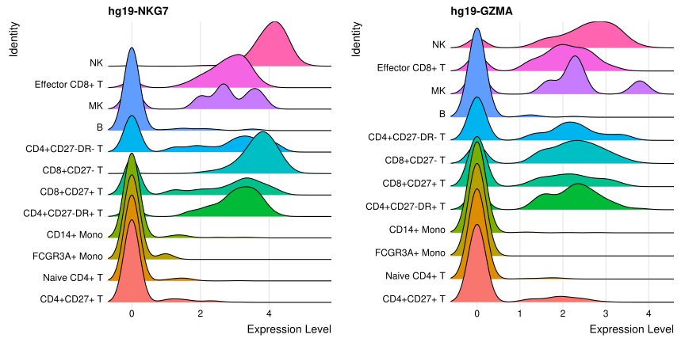

# Specter: A novel tool for clustering large-scale single cell RNA-seq and multi-modal data

Overview
--------

This is a MATLAB Package of Specter. Specter is a novel computational method for clustering large-scale single cell RNA-seq data. In addition, Specter can combine the data from different measurements such as RNA measurements and the antibody-derived tags (collected on the same set of cells). Specter runs in linear time with respect to number of cells, thus it is very suitable for analyzing very big single cell RNA-seq data. On a data set comprising 2 million cells from mouse embryos, Specter requires only 26 minutes to compute the clusters. 

#### Specter enhances cell type identification

Numerous methods have been proposed for clustering scRNA-seq data sets, with Seurat and its underlying Louvain clustering algorithm being arguably the most widely used one. We showed that Specter outperforms Seurat in term of accurary and speed on a large number of real scRNA-seq datasets. Moreover, Specter can highlight rare cell types in which Seurat might not find.

#### Using Specter with multi-modal data

On multi-modal dataset of 8,617 cord blood mononuclear cells (CBMCs), produced by CITE-seq (Stoeckius et al. (2017)). The authors measure the single cell transcriptomes alongside the expression of 11 surface proteins, whose levels are quantified with DNA-barcoded antibodie. When we combine transtriptomic counts (mRNA) and antibody-derived tags (ADT), Specter is able to utilize multimodal omics measurements to resolve subtle transcriptomic differences between subpopulations of cells.


Systems Requirements
--------------------

Specter is independent of operating systems because it is written in Matlab. Basic requirement for running Specter includes MATLAB and the Statistics and Machine Learning Toolbox. 

This Package has been tested using MATLAB 2018a on Linux. 


Usage
-----

Unzip the package. Change the current directory in Matlab to the folder containing the scripts.

This directory includes the following main scripts:
1) Specter_demo.m -- an example run of Specter on a specific dataset
2) eval_exact_Specter.m -- run exact Specter algorithm (time complexity: O(n^2)) 
3) eval_fast_Specter.m -- run fast Specter algorithm (time complexity: O(n))
---------------------------
4) run_multimodal_Specter.m -- an example of running Specter on multi-modal data (PBMCs).


Please refer to Specter_demo.m for instructions on how to use this code.
Input Data are gene expression data matrix (columns are genes (PCs) and rows are cells). 

## Analyze multimodal clustering from Specter

This tutorial will demonstrate the annotation of cell types using the results produced by Specter. We analyze a CITE-seq data from healthy human PBMCs (Mimitou et al., 2019). We use Seurat R package for data preprocessing and visualization.  

### Load library and data

``` r
library(Seurat)
library(ggplot2)
library(mclust)
library(plyr)
library(dplyr)    
```

Next we load two count matrices : one for the RNA measurements, and one
for the antibody-derived tags
(ADT).

``` r
# First we load the selected cells by CiteFuse doublet removal. 
selected_cells <- read.csv(file = "data/pbmc_nodoublet_minPts50_selectedcells.csv", sep = ",", 
header = TRUE, row.names = 1)
# Read data
pbmc.rna <- as.sparse(read.csv(file = "/data/data_nobackup/hoan/Mimitou/pbmc_rna.csv", sep = ",", 
                               header = TRUE, row.names = 1))
pbmc.rna <- pbmc.rna[, rownames(selected_cells)] # remove doublet

# Load in the ADT UMI matrix
adt <- read.csv(file = "/data/data_nobackup/hoan/Mimitou/pbmc_adt.csv", sep = ",", 
                header = TRUE, row.names = 1)
pbmc.adt <- as.sparse(adt[1:49, ])
pbmc.adt <- pbmc.adt[ ,rownames(selected_cells)]
```

### Create Seurat object and preprocess the data

#### Preprocessing mRNA

``` r
pbmc <- CreateSeuratObject(counts = pbmc.rna)
# standard log-normalization
pbmc <- NormalizeData(pbmc)
# choose variable features
pbmc <- FindVariableFeatures(pbmc)
# standard scaling
pbmc <- ScaleData(pbmc)
```

Run dimentionality reduction

``` r
# Run PCA, select 20 PCs for tSNE visualization and graph-based clustering
pbmc <- RunPCA(pbmc, verbose = FALSE)
# Run t-SNE on mRNA
pbmc <- RunTSNE(pbmc, dims = 1:20, method = "FIt-SNE")
# DimPlot(pbmc, label = TRUE) + NoLegend()
```

#### Preprocessing ADT

``` r
pbmc[["ADT"]] <- CreateAssayObject(counts = pbmc.adt)
# Use a centered log-ratio (CLR) normalization
pbmc <- NormalizeData(pbmc, assay = "ADT", normalization.method = "CLR")
pbmc <- ScaleData(pbmc, assay = "ADT")
```

Run dimentionality reduction

``` r
# Set ADT data as default. 
DefaultAssay(pbmc) <- "ADT"
pbmc <- RunPCA(pbmc, features = rownames(pbmc), reduction.name = "pca_adt", reduction.key = "pca_adt_", 
               verbose = FALSE)
#DimPlot(pbmc, reduction = "pca_adt")
# Compute a standard euclidean distance matrix, which is used for visualization and clustering ADT count
adt.data <- GetAssayData(pbmc, slot = "data")
adt.dist <- dist(t(adt.data))

# Compute tSNE using our distance matrix defined only on ADT (protein) levels.
pbmc[["tsne_adt"]] <- RunTSNE(adt.dist, assay = "ADT", reduction.key = "adtTSNE_")

#DimPlot(pbmc, reduction = "tsne_adt") + NoLegend()
```

### Read and visualize clusters from Specter

``` r
# Load the results from Specter. Run the file 'run_multimodal_Specter.m' to get the results We also store the output in directory output and you can load it directly without running the script.
sce_labels <- read.csv("output/pbmc_specter_clustering.csv", header = F)
sce_labels <- as.factor(sce_labels$V1)
names(sce_labels) <- pbmc.adt@Dimnames[[2]]

pbmc[["sceClusterID"]] <- sce_labels
DefaultAssay(pbmc) <- "RNA"
Idents(pbmc) <- sce_labels
```

``` r
#Plot clusters on RNA and ADT t-SNE. 
tsne_rnaClusters <- DimPlot(pbmc, reduction = "tsne", group.by = "sceClusterID") + NoLegend()
tsne_rnaClusters <- tsne_rnaClusters + ggtitle("Specter's clusters on RNA") + theme(plot.title = element_text(hjust = 0.5))
tsne_rnaClusters <- LabelClusters(plot = tsne_rnaClusters, id = "sceClusterID", size = 4)

tsne_adtClusters <- DimPlot(pbmc, reduction = "tsne_adt", group.by = "sceClusterID", pt.size = 0.5) + NoLegend()
tsne_adtClusters <- tsne_adtClusters + ggtitle("Specter's clusters on ADT") + theme(plot.title = element_text(hjust = 0.5))
tsne_adtClusters <- LabelClusters(plot = tsne_adtClusters, id = "sceClusterID", size = 4)
CombinePlots(plots = list(tsne_rnaClusters, tsne_adtClusters), ncol = 2)
```

<!-- -->

### Running DE test to assign cell type identity to clusters

#### DE test on RNA

**Note that gene name starts with a prefix “hg19”.**

``` r
# We need to switch to RNA
DefaultAssay(pbmc) <- "RNA"
specter.rna.markers <- FindAllMarkers(pbmc, max.cells.per.ident = 100, min.diff.pct = 0.3, only.pos = TRUE)
# Extract top 10 marker genes for each cluster
rna.top10 <- specter.rna.markers %>% group_by(cluster) %>% top_n(n = 10, wt = avg_logFC)
# head(rna.top10, n = 15)
```

You can plot heatmap on top markers genes

``` r
# Plot heatmap on top marker ADTs
# DoHeatmap(pbmc, features = unique(rna.top10$gene), assay = "RNA", angle = 0) 
```

#### DE test on ADT

``` r
# Find protein markers for all clusters, and draw a heatmap
DefaultAssay(pbmc) <- "ADT"
adt.markers <- FindAllMarkers(pbmc, assay = "ADT", only.pos = TRUE)
# Extract ADT top 10 markers
adt.top10 <- adt.markers %>% group_by(cluster) %>% top_n(n = 10, wt = avg_logFC)
#head(adt.top10, n = 15)
```

Plot heatmap on 10 markers ADT, but it is not very informative.

``` r
# Plot heatmap on top marker ADTs
#DoHeatmap(pbmc, features = unique(adt.top10$gene), assay = "ADT", angle = 0) 
```

For PBMCs cells we have canonical markers to match the unbiased
clustering to known cell types:

| Cell Type    | Marker genes       |
| ------------ | ------------------ |
| Naive CD4+ T | IL7R, CCR7, SELL   |
| Memory CD4+  | IL7R, S100A4, CD27 |
| CD14+ Mono   | CD14, LYZ          |
| B            | MS4A1              |
| CD8+ T       | CD8A               |
| FCGR3A+ Mono | FCGR3A, MS4A7      |
| NK           | GNLY, NKG7         |
| DC           | FCER1A, CST3       |

#### Look at the top marker genes and ADT, we get the following cluster IDs.

``` r
new.cluster.ids <- c("CD8+CD27+ T","CD4+CD27-DR+ T","CD14+ Mono","FCGR3A+ Mono","CD8+CD27+ T","Naive CD4+ T","CD8+CD27- T","CD8+CD27- T", "CD8+CD27- T","Doublets","CD8+CD27- T","CD4+CD27+DR- T","MK","Effector CD8+ T","NK","B")
```

#### Visualize on cluster IDs

``` r
sce_labels <- mapvalues(sce_labels, from = levels(sce_labels), to = new.cluster.ids)
pbmc[["sceClusterID"]] <- sce_labels
Idents(pbmc) <- sce_labels
```

``` r
#Plot clusters on RNA and ADT t-SNE. 
tsne_rnaClusters <- DimPlot(pbmc, reduction = "tsne", group.by = "sceClusterID") + NoLegend()
tsne_rnaClusters <- tsne_rnaClusters + ggtitle("Specter's clusters on RNA") + theme(plot.title = element_text(hjust = 0.5))
tsne_rnaClusters <- LabelClusters(plot = tsne_rnaClusters, id = "sceClusterID", size = 4)

tsne_adtClusters <- DimPlot(pbmc, reduction = "tsne_adt", group.by = "sceClusterID", pt.size = 0.5) + NoLegend()
tsne_adtClusters <- tsne_adtClusters + ggtitle("Specter's clusters on ADT") + theme(plot.title = element_text(hjust = 0.5))
tsne_adtClusters <- LabelClusters(plot = tsne_adtClusters, id = "sceClusterID", size = 4)
CombinePlots(plots = list(tsne_rnaClusters, tsne_adtClusters), ncol = 2)
```

<!-- -->

### Validation

Confirm CD27+ vs CD27- subtypes (based on CD27)

``` r
RidgePlot(pbmc, assay = "ADT", features = c("CD27"), ncol = 2)
```

<!-- -->

Confirm DR+ DR- subtype based on genes “NKG7”, “GZMA” 

``` r
all_markers <- c("NKG7", "GZMA")
RidgePlot(pbmc, assay = "RNA", features = paste("hg19-", all_markers, sep=""), ncol = 2)
```

<!-- -->


References
-----
Stoeckius, M. et al. (2017). Simultaneous epitope and transcriptome
measurement in single cells. Nature Methods, 14(9), 865–868. <br>
Mimitou, E.P. et al. (2019). Multiplexed detection of proteins, transcriptomes, 
clonotypes and CRISPR perturbations in single cells. Nature Methods, 16(5), 409–412.

