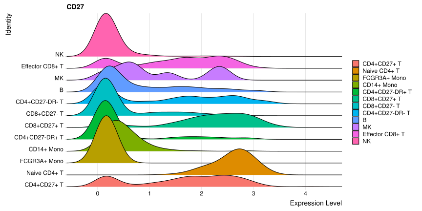
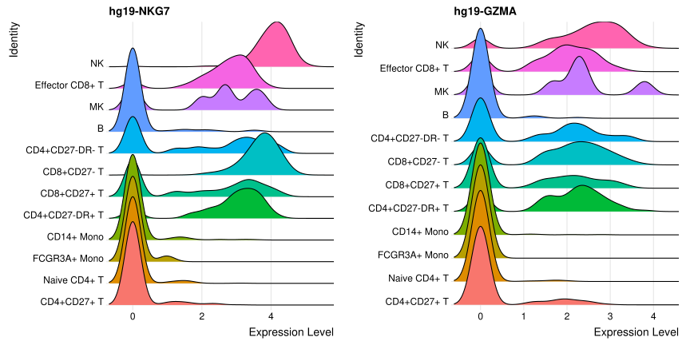

Analyze multimodal clustering from Specter
================
Canzar Lab
4/14/2020

## Load library and data

``` r
library(Seurat)
library(ggplot2)
library(mclust)
library(plyr)
library(dplyr)    
```

Next we load two count matrices : one for the RNA measurements, and one
for the antibody-derived tags
(ADT).

``` r
selected_cells <- read.csv(file = "/data/results_nobackup/hoan/mimitou_clustering/pbmc_nodoublet_minPts50_selectedcells.csv", sep = ",", 
                           header = TRUE, row.names = 1)

pbmc.rna <- as.sparse(read.csv(file = "/data/data_nobackup/hoan/Mimitou/pbmc_rna.csv", sep = ",", 
                               header = TRUE, row.names = 1))
pbmc.rna <- pbmc.rna[, rownames(selected_cells)] # remove doublet

# Load in the ADT UMI matrix
adt <- read.csv(file = "/data/data_nobackup/hoan/Mimitou/pbmc_adt.csv", sep = ",", 
                header = TRUE, row.names = 1)
pbmc.adt <- as.sparse(adt[1:49, ])
pbmc.adt <- pbmc.adt[ ,rownames(selected_cells)]
```

## Create Seurat object and preprocess the data

### Preprocessing mRNA

``` r
pbmc <- CreateSeuratObject(counts = pbmc.rna)
# standard log-normalization
pbmc <- NormalizeData(pbmc)
# choose variable features
pbmc <- FindVariableFeatures(pbmc)
# standard scaling
pbmc <- ScaleData(pbmc)
```

    ## Centering and scaling data matrix

``` r
# Run PCA, select 20 PCs for tSNE visualization and graph-based clustering
pbmc <- RunPCA(pbmc, verbose = FALSE)
# Run t-SNE on mRNA
pbmc <- RunTSNE(pbmc, dims = 1:20, method = "FIt-SNE")
# DimPlot(pbmc, label = TRUE) + NoLegend()
```

### Preprocessing ADT

``` r
pbmc[["ADT"]] <- CreateAssayObject(counts = pbmc.adt)

# Use a centered log-ratio (CLR) normalization
pbmc <- NormalizeData(pbmc, assay = "ADT", normalization.method = "CLR")
```

    ## Normalizing across features

``` r
pbmc <- ScaleData(pbmc, assay = "ADT")
```

    ## Centering and scaling data matrix

``` r
# Set ADT data as default. 
DefaultAssay(pbmc) <- "ADT"
pbmc <- RunPCA(pbmc, features = rownames(pbmc), reduction.name = "pca_adt", reduction.key = "pca_adt_", 
               verbose = FALSE)
#DimPlot(pbmc, reduction = "pca_adt")
# Compute a standard euclidean distance matrix, which is used for visualization and clustering ADT count
adt.data <- GetAssayData(pbmc, slot = "data")
adt.dist <- dist(t(adt.data))

# Compute tSNE using our distance matrix defined only on ADT (protein) levels.
pbmc[["tsne_adt"]] <- RunTSNE(adt.dist, assay = "ADT", reduction.key = "adtTSNE_")

#DimPlot(pbmc, reduction = "tsne_adt") + NoLegend()
```

## Read and visualize clusters from Specter

``` r
sce_labels <- read.csv("/data/hoan/Specter/output/pbmc_nodoublet_minPts50_mimitou_adtK16_gamma_0.9_rnaK_16_gamma_0.5_labels_v2.csv", header = F)
sce_labels <- as.factor(sce_labels$V1)
names(sce_labels) <- pbmc.adt@Dimnames[[2]]

pbmc[["sceClusterID"]] <- sce_labels
DefaultAssay(pbmc) <- "RNA"
Idents(pbmc) <- sce_labels
```

``` r
#Plot clusters on RNA and ADT t-SNE. 
tsne_rnaClusters <- DimPlot(pbmc, reduction = "tsne", group.by = "sceClusterID") + NoLegend()
tsne_rnaClusters <- tsne_rnaClusters + ggtitle("Specter's clusters on RNA") + theme(plot.title = element_text(hjust = 0.5))
tsne_rnaClusters <- LabelClusters(plot = tsne_rnaClusters, id = "sceClusterID", size = 4)

tsne_adtClusters <- DimPlot(pbmc, reduction = "tsne_adt", group.by = "sceClusterID", pt.size = 0.5) + NoLegend()
tsne_adtClusters <- tsne_adtClusters + ggtitle("Specter's clusters on ADT") + theme(plot.title = element_text(hjust = 0.5))
tsne_adtClusters <- LabelClusters(plot = tsne_adtClusters, id = "sceClusterID", size = 4)
CombinePlots(plots = list(tsne_rnaClusters, tsne_adtClusters), ncol = 2)
```

<!-- -->

## Running DE test to assign cell type identity to clusters

### DE test on RNA

**Note that gene name starts with a prefix “hg19”.**

``` r
# We need to switch to RNA
DefaultAssay(pbmc) <- "RNA"
specter.rna.markers <- FindAllMarkers(pbmc, max.cells.per.ident = 100, min.diff.pct = 0.3, only.pos = TRUE)
# Extract top 10 marker genes for each cluster
rna.top10 <- specter.rna.markers %>% group_by(cluster) %>% top_n(n = 10, wt = avg_logFC)
# head(rna.top10, n = 15)
```

You can plot heatmap on top markers genes

``` r
# Plot heatmap on top marker ADTs
# DoHeatmap(pbmc, features = unique(rna.top10$gene), assay = "RNA", angle = 0) 
```

### DE test on ADT

``` r
# Find protein markers for all clusters, and draw a heatmap
DefaultAssay(pbmc) <- "ADT"
adt.markers <- FindAllMarkers(pbmc, assay = "ADT", only.pos = TRUE)
# Extract ADT top 10 markers
adt.top10 <- adt.markers %>% group_by(cluster) %>% top_n(n = 10, wt = avg_logFC)
#head(adt.top10, n = 15)
```

Plot heatmap on 10 markers ADT, but it is not very informative.

``` r
# Plot heatmap on top marker ADTs
#DoHeatmap(pbmc, features = unique(adt.top10$gene), assay = "ADT", angle = 0) 
```

For PBMCs cells we have canonical markers to match the unbiased
clustering to known cell types:

| Cell Type    | Marker genes       |
| ------------ | ------------------ |
| Naive CD4+ T | IL7R, CCR7, SELL   |
| Memory CD4+  | IL7R, S100A4, CD27 |
| CD14+ Mono   | CD14, LYZ          |
| B            | MS4A1              |
| CD8+ T       | CD8A               |
| FCGR3A+ Mono | FCGR3A, MS4A7      |
| NK           | GNLY, NKG7         |
| DC           | FCER1A, CST3       |

### Look at the top marker genes and ADT, we get the following cluster IDs.

``` r
new.cluster.ids <- c("CD8+CD27+ T","CD4+CD27-DR+ T","CD14+ Mono","FCGR3A+ Mono","CD8+CD27+ T","Naive CD4+ T","CD8+CD27- T","CD8+CD27- T", "CD8+CD27- T","Doublets","CD8+CD27- T","CD4+CD27+DR- T","MK","Effector CD8+ T","NK","B")
```

### Visualize on cluster IDs

``` r
sce_labels <- mapvalues(sce_labels, from = levels(sce_labels), to = new.cluster.ids)
pbmc[["sceClusterID"]] <- sce_labels
Idents(pbmc) <- sce_labels
```

``` r
#Plot clusters on RNA and ADT t-SNE. 
tsne_rnaClusters <- DimPlot(pbmc, reduction = "tsne", group.by = "sceClusterID") + NoLegend()
tsne_rnaClusters <- tsne_rnaClusters + ggtitle("Specter's clusters on RNA") + theme(plot.title = element_text(hjust = 0.5))
tsne_rnaClusters <- LabelClusters(plot = tsne_rnaClusters, id = "sceClusterID", size = 4)

tsne_adtClusters <- DimPlot(pbmc, reduction = "tsne_adt", group.by = "sceClusterID", pt.size = 0.5) + NoLegend()
tsne_adtClusters <- tsne_adtClusters + ggtitle("Specter's clusters on ADT") + theme(plot.title = element_text(hjust = 0.5))
tsne_adtClusters <- LabelClusters(plot = tsne_adtClusters, id = "sceClusterID", size = 4)
CombinePlots(plots = list(tsne_rnaClusters, tsne_adtClusters), ncol = 2)
```

<!-- -->

## Cluster validation

### Similar celltypes as Specter

Confirm CD27+ vs CD27- subtypes (based on
CD27)

``` r
RidgePlot(pbmc, assay = "ADT", features = c("CD27"), ncol = 2)
```

<!-- -->

Confirm DR+ DR- subtype based on genes “NKG7”, “GZMA” (see Specter)

``` r
all_markers <- c("NKG7", "GZMA")
RidgePlot(pbmc, assay = "RNA", features = paste("hg19-", all_markers, sep=""), ncol = 2)
```

<!-- -->
